<div align="center">

<a href="https://github.com/kailashyogeshwar85">

</a>

<br/>

<p>
<a href="https://www.linkedin.com/in/kailash.yogeshwar/"></a>&nbsp;&nbsp;
<a href="https://kailashyogeshwar.medium.com/"></a>&nbsp;&nbsp;
<a href="mailto:kailashyogeshwar85@gmail.com"></a>&nbsp;&nbsp;
<a href="https://hub.docker.com/u/lucifer8591"></a>&nbsp;&nbsp;
<a href="https://www.npmjs.com/~kailash.yogeshwar"></a>
</p>

</div>

<br/>

<table>
<tr>
<td width="55%" valign="top">

### What I Do

I design and build **backend systems** that handle real-world scale — message queues that process millions of events, microservices that stay up at 3 AM, and CI/CD pipelines that just work.

After a decade in the trenches, I care most about **reliability**, **observability**, and writing code that the next engineer can actually understand.

Currently architecting at a **stealth startup** in Bangalore.

**Areas of expertise:**

```
Distributed Systems    Event-Driven Architecture
Microservices          Container Orchestration
Observability          CI/CD & Platform Engineering
API Design             Message Brokers & Streaming
```

</td>
<td width="45%" valign="top">

### Currently

- Building production systems at **Stealth**
- Contributing to **open-source** infrastructure tooling
- Writing about backend engineering on **[Medium](https://kailashyogeshwar.medium.com/)**
- Maintaining **56 public repositories**

### Technologies I Reach For

<p>

</p>
<p>

</p>
<p>

</p>

</td>
</tr>
</table>

<br/>

<div align="center">

## Contribution Graph


<br/>

<!-- Snake animation — auto-generated by GitHub Actions (run the workflow once after pushing) -->
<picture>
  <source media="(prefers-color-scheme: dark)" srcset="https://raw.githubusercontent.com/kailashyogeshwar85/kailashyogeshwar85/output/github-snake-dark.svg" />
  <source media="(prefers-color-scheme: light)" srcset="https://raw.githubusercontent.com/kailashyogeshwar85/kailashyogeshwar85/output/github-snake.svg" />
  
</picture>

</div>

<br/>

<div align="center">

## GitHub Analytics

<br/>


<br/><br/>


<br/><br/>


<br/><br/>


</div>

<br/>

## Featured Work

<div align="center">

<a href="https://github.com/kailashyogeshwar85/docker-rabbitmq-cluster">

</a>&nbsp;
<a href="https://github.com/kailashyogeshwar85/slim-orderbook">

</a>

<a href="https://github.com/kailashyogeshwar85/otel-jaegar">

</a>&nbsp;
<a href="https://github.com/kailashyogeshwar85/knative-tekton-cicd">

</a>

<a href="https://github.com/kailashyogeshwar85/braille-loaders">

</a>&nbsp;
<a href="https://github.com/kailashyogeshwar85/log4-microservice">

</a>

</div>

<br/>

## Open Source

<table>
<tr>
<td width="50%" valign="top">

**Infrastructure & Observability**

| Project | What it does |
|:--------|:-------------|
| [`docker-rabbitmq-cluster`](https://github.com/kailashyogeshwar85/docker-rabbitmq-cluster) | Production-ready RabbitMQ cluster images |
| [`fluent-plugin-mongo`](https://github.com/kailashyogeshwar85/fluent-plugin-mongo) | MongoDB output plugin for Fluentd |
| [`otel-jaegar`](https://github.com/kailashyogeshwar85/otel-jaegar) | OpenTelemetry tracing with Jaeger |
| [`knative-tekton-cicd`](https://github.com/kailashyogeshwar85/knative-tekton-cicd) | K8s-native CI/CD with Knative + Tekton |
| [`fluentd`](https://github.com/kailashyogeshwar85/fluentd) | Custom Fluentd container configs |

</td>
<td width="50%" valign="top">

**Developer Tools & Libraries**

| Project | What it does |
|:--------|:-------------|
| [`log4-microservice`](https://github.com/kailashyogeshwar85/log4-microservice) | Pluggable logger (Pino/Winston/Bunyan) |
| [`validate-derived-field`](https://github.com/kailashyogeshwar85/validate-derived-field) | Dynamic schema-based field validator |
| [`jwt-inspector`](https://github.com/kailashyogeshwar85/jwt-inspector) | VS Code extension for JWT inspection |
| [`braille-loaders`](https://github.com/kailashyogeshwar85/braille-loaders) | 64 animated CLI spinner types |
| [`latesttag`](https://github.com/kailashyogeshwar85/latesttag) | CLI to find latest semver tag |

</td>
</tr>
</table>

<br/>

---

<div align="center">


<br/><br/>

**Let's build something together.**

*I'm open to collaborating on distributed systems, developer tooling, and open-source infrastructure.*

<br/>

<a href="https://www.linkedin.com/in/kailash.yogeshwar/">

</a>

<br/><br/>

</div>
